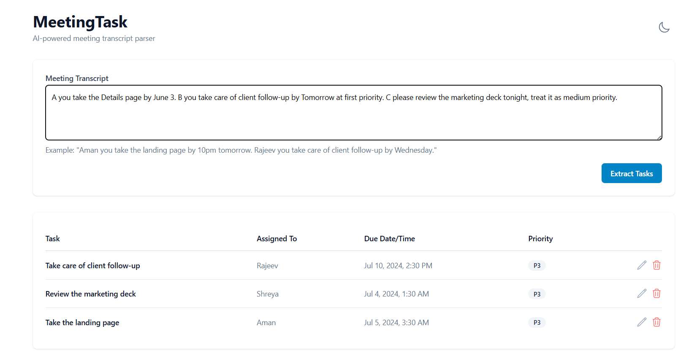
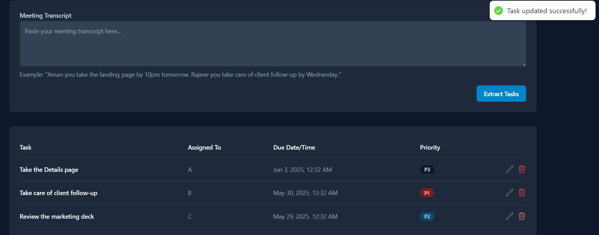

# MeetingTask - AI-Powered Meeting Transcript Parser

MeetingTask is an intelligent application that automatically extracts tasks from meeting transcripts. Simply paste your meeting transcript, and the application will identify tasks, assignees, deadlines, and priorities, presenting them in a clean, organized task board.

## Features

- Natural language meeting transcript processing
- Automatic extraction of:
  - Task description
  - Assignee
  - Due date and time
  - Priority level (P1-P4, defaults to P3)
- Beautiful and responsive UI with light/dark mode support
- Real-time task management
- Editable task board
- Task prioritization
- Modern and intuitive user interface

## Tech Stack

### Frontend
- React with TypeScript
- Tailwind CSS for styling
- React Query for state management
- Axios for API calls

### Backend
- Node.js with Express
- MongoDB for database
- Google Gemini AI for natural language processing
- TypeScript for type safety

## Prerequisites

- Node.js (v14 or higher)
- MongoDB
- Google Gemini API key

## Setup Instructions

1. Clone the repository:
```bash
git clone https://github.com/Kini99/MisogiAI-AI-Meeting-Minutes-to-Task-Converter.git
```

2. Install dependencies:
```bash
# Install backend dependencies
cd backend
npm install

# Install frontend dependencies
cd ../frontend
npm install
```

3. Environment Setup:
   - Create a `.env` file in the backend directory
   - Add your Google Gemini API key:
   ```
   GEMINI_API_KEY=your_api_key_here
   MONGODB_URI=your_mongodb_uri
   PORT=5000
   ```

4. Start the development servers:
```bash
# Start backend server (from backend directory)
npm run dev

# Start frontend server (from frontend directory)
npm run dev
```

5. Access the application:
   - Frontend: http://localhost:3000
   - Backend: http://localhost:5000

## Project Structure

```
meetingtask/
├── frontend/           # React frontend application
│   ├── src/
│   │   ├── components/
│   │   ├── pages/
│   │   ├── hooks/
│   │   ├── types/
│   │   └── utils/
│   └── tailwind.config.js
│
└── backend/           # Node.js backend application
    ├── src/
    │   ├── controllers/
    │   ├── models/
    │   ├── routes/
    │   ├── services/
    │   └── utils/
    └── .env
```

## Example Usage

Input transcript:
```
"Aman you take the landing page by 10pm tomorrow. Rajeev you take care of client follow-up by Wednesday. Shreya please review the marketing deck tonight."
```

Output tasks:
| Task | Assigned To | Due Date/Time | Priority |
|------|-------------|---------------|----------|
| Take the landing page | Aman | 10:00 PM, Tomorrow | P3 |
| Client follow-up | Rajeev | Wednesday | P3 |
| Review the marketing deck | Shreya | Tonight | P3 |

## Example Output:



